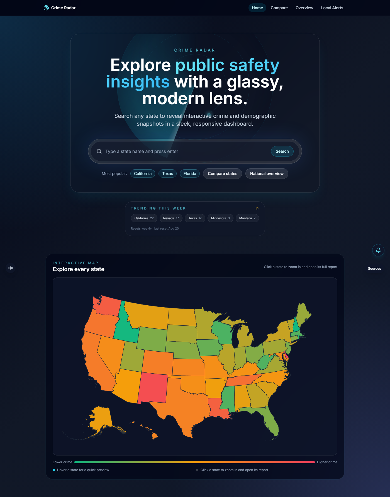
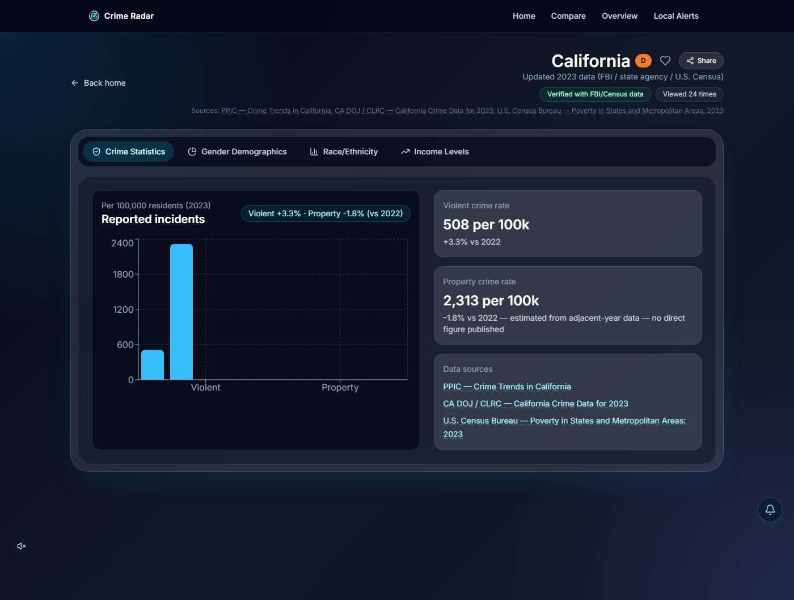
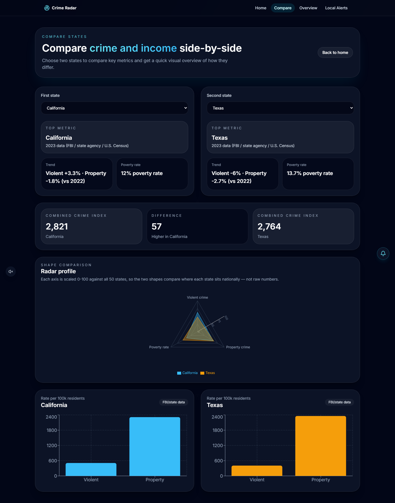

# Crime Radar

A dashboard for exploring U.S. crime, arrest, and poverty statistics by state — an interactive map, side-by-side state comparisons, and national rankings, built on real FBI/state-agency and U.S. Census data.

**Live:** [crimeradar.platinumsoftwaremn.com](https://crimeradar.platinumsoftwaremn.com)



## Features

- **Interactive U.S. map** — every state colored on a green→red gradient by combined crime index, with click-to-zoom navigation into a full state report.
- **State detail pages** — crime rates, gender/race arrest demographics, and income/poverty data across tabbed charts, each with a computed A–F safety grade relative to the other 49 states.
- **Compare** — pick any two states and see a normalized radar/spider chart alongside raw crime-rate bar charts.
- **National Overview** — rankings across all 50 states by combined crime index, violent crime rate, and poverty rate.
- **Favorites, recent searches, and trending states**, backed by a small Cloudflare Worker API with KV-based view counts.
- **Local Alerts** — state/city-scoped news feed with an email signup flow.

<p>
  
  
</p>

## Engineering highlights

A few things worth calling out beyond the feature list:

- **Cut the initial homepage bundle by 91%** (143 kB → 12.6 kB) by code-splitting the map's dependencies (`react-simple-maps`, `d3-geo`) into their own lazy-loaded chunk, so the hero and search bar are interactive without waiting on map-library weight.
- **Built a prerendering pipeline for a client-rendered SPA.** A Playwright script crawls all 54 real routes against the production build and writes fully-rendered HTML snapshots, so search engines and social-link previews (most of which don't execute JS) see real content instead of an empty `<div id="root">` — while real users still get the normal client-rendered app once it hydrates.
- **Per-state social preview images**, generated at build time by screenshotting a dedicated 1200×630 route per state (safety grade, headline stats) and wired into Open Graph/Twitter Card meta tags — so a shared state link actually looks like something worth clicking.
- **Self-updating sitemap.xml**, generated from the live state dataset on every build so it can't silently drift out of sync with the app.
- Guarded the build pipeline against a real correctness bug: the prerender crawler visits every state page in a headless browser, which would otherwise fire real POST requests against the live view-counter API on every single build. A `window.__PRERENDERING__` flag suppresses that (and the auto-popup signup modal) during crawls.

## Tech stack

**Frontend**
- React 18 + React Router, built with Vite
- Tailwind CSS
- Framer Motion (animations, page transitions)
- Recharts (bar/line/pie/radar charts)
- react-simple-maps + d3-geo (interactive US map)

**Backend**
- Cloudflare Workers (API), with a KV namespace for view counts and cron-triggered scheduled jobs

**Tooling**
- Vitest + React Testing Library
- ESLint
- Playwright (build-time prerendering and OG image generation)

## Getting started

```bash
npm install
npm run dev
```

Runs the app at `http://localhost:3000`.

### Scripts

| Command | What it does |
| --- | --- |
| `npm run dev` | Start the Vite dev server |
| `npm run build` | Production build — regenerates `sitemap.xml`, runs `vite build`, then prerenders all routes |
| `npm run preview` | Serve the built `dist/` locally |
| `npm test` | Run the Vitest suite once |
| `npm run test:watch` | Run tests in watch mode |
| `npm run lint` | ESLint across the project |
| `npm run sitemap` | Regenerate `sitemap.xml` on its own |
| `npm run prerender` | Re-run prerendering against an existing `dist/` |
| `npm run og-images` | Regenerate per-state social preview images (not run automatically — see note in the script) |

The Worker API lives in `worker/` as its own package (`cd worker && npm install`), deployed separately via `wrangler`.

## Testing

Unit and component tests with Vitest + React Testing Library, covering the data/stats utilities, services, and key pages (`npm test`).
